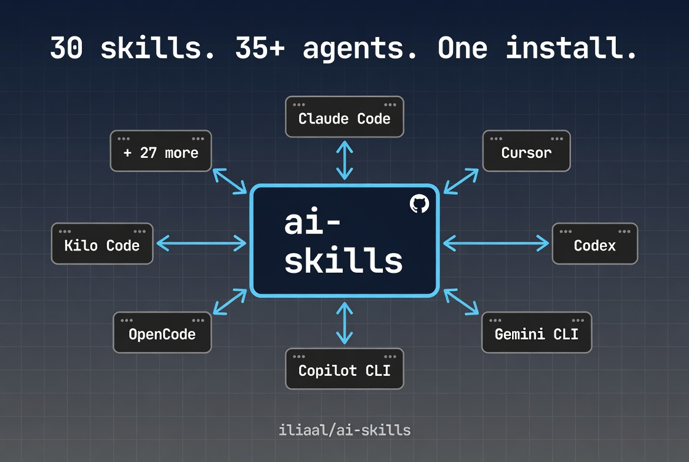

# AI Skills

[](https://code.claude.com/docs/en/skills)
[](https://clawhub.ai/u/iliaal)
[](LICENSE)
[](https://x.com/intent/follow?screen_name=iliaa)



Compact, opinionated skills that change how AI coding agents behave. Behavioral rules that enforce discipline and catch mistakes, triggered by what you're working on. Works with 35+ agents through one install command.

> **Note:** This repo is a read-only mirror of skills from the [compound-engineering plugin](https://github.com/iliaal/compound-engineering-plugin). Edits happen upstream; this repo exists for distribution via `npx skills add`.

## The Problem

AI coding agents skip planning, claim "done" without verifying, patch symptoms over root causes, and forget what they learned when context resets. The output looks polished. The behavior underneath is undisciplined.

The long-form argument is at [AI Agents Don't Lack Capability. They Lack Process.](https://ilia.ws/blog/ai-agents-dont-lack-capability-they-lack-process). These skills are the portable enforcement layer.

## Install

### On Claude Code? Use the full plugin instead.

The [compound-engineering plugin](https://github.com/iliaal/compound-engineering-plugin) is the recommended path on Claude Code. It bundles these skills plus 19 specialized agents, 22 workflow commands, an MCP server, and skill-injection hooks for subagents. Skills alone do behavioral discipline; the full plugin orchestrates entire workflows.

```bash
/plugin marketplace add https://github.com/iliaal/compound-engineering-plugin
/plugin install compound-engineering
```

### Any other agent

```bash
# All skills
npx skills add iliaal/ai-skills

# Single skill
npx skills add iliaal/ai-skills -s code-review
```

### Platform-specific

```bash
# Cursor
npx skills add iliaal/ai-skills -a cursor

# Codex
npx skills add iliaal/ai-skills -a codex

# Gemini CLI
npx skills add iliaal/ai-skills -a gemini

# GitHub Copilot CLI
npx skills add iliaal/ai-skills -a copilot

# Claude Code (skills only, no plugin)
npx skills add iliaal/ai-skills -a claude-code
```

Works with Claude Code, Cursor, Codex, Gemini CLI, GitHub Copilot CLI, OpenCode, OpenClaw, Kilo Code, and [35+ other agents](https://agentskills.io).

## Skills

### Architecture & design

| Skill | Description |
|-------|------------|
| [agent-native-architecture](skills/agent-native-architecture) | Enforces a 15-area architecture checklist for systems where AI agents are primary actors: tool design, execution patterns, context injection, approval gates, audit trails. Use when designing agent systems or MCP tools. |
| [frontend-design](skills/frontend-design) | Requires a design philosophy statement before code, detects existing design systems to match, and bans AI design cliches (purple-to-blue gradients, Space Grotesk, three-card hero layouts). Calibrates output via variance, motion, and density parameters. Use when visual identity matters. |
| [simplifying-code](skills/simplifying-code) | Declutters code without changing behavior. Targets AI slop: redundant comments, unnecessary defensive checks, over-abstraction, verbose stdlib reimplementations. Applies changes in priority order and stops before touching public APIs. Use when code needs cleanup after AI generation or accumulated complexity. |

### Development

| Skill | Description |
|-------|------------|
| [react-frontend](skills/react-frontend) | Decision tree routing most "should I use an effect?" questions to non-effect solutions. Separates state tools by purpose (Zustand for client, React Query for server, nuqs for URL). Enforces React 19 patterns, App Router server/client boundaries, and flags that Server Actions are public endpoints. Use for React, Next.js, and Vitest/RTL testing. |
| [nodejs-backend](skills/nodejs-backend) | Strict layered architecture (routes > services > repos) with no cross-layer HTTP imports. Contract-first API design using Zod schemas as the single source of truth. Production patterns like circuit breaker and load shedding as requirements, not suggestions. Use for Express, Fastify, Hono, or NestJS backends. |
| [python-services](skills/python-services) | Mandates modern tooling (uv, ruff, ty) over legacy equivalents. Structured concurrency via `asyncio.TaskGroup`, idempotent background jobs, and structured JSON logging with correlation IDs via `contextvars`. Use for Python CLI tools, FastAPI services, async workers, or new project setup. |
| [php-laravel](skills/php-laravel) | `declare(strict_types=1)` everywhere, PHPStan level 8+, fat models / thin controllers, Form Requests with `toDto()`, event-driven side effects. Prevents N+1 by disabling lazy loading in dev. Defaults to feature tests through the full HTTP stack. Use for Laravel codebases. |
| [rust-systems](skills/rust-systems) | Edition 2024, workspace layout with inward-only deps, `thiserror` in libraries / `anyhow` in binaries, no `unwrap`/`expect` outside `main` and tests, every `unsafe` block needs a `// SAFETY:` comment. Tokio patterns (JoinSet, CancellationToken, bounded mpsc) and axum service layout. Use for Rust CLIs, axum services, or cargo workspaces. |
| [pinescript](skills/pinescript) | Prevents silent TradingView errors (ternary formatting, `plot()` scope restrictions), enforces `barstate.isconfirmed` to avoid repainting, requires walk-forward validation over pure backtesting. Flags indicator stacking and overfitted parameters. Use for Pine Script v6. |
| [tailwind-css](skills/tailwind-css) | Enforces v4's CSS-first config model (`@theme`, `@utility`, `@custom-variant` directives). Provides a v3-to-v4 breaking changes table. Prohibits dynamic class construction, mandates `gap` over `space-x`, `size-*` over paired `w-*/h-*`. Use when styling with Tailwind v4 or migrating from v3. |

### Infrastructure

| Skill | Description |
|-------|------------|
| [postgresql](skills/postgresql) | BIGINT GENERATED ALWAYS AS IDENTITY over SERIAL, TIMESTAMPTZ over TIMESTAMP, indexes on every FK (Postgres doesn't auto-create them). Includes an unindexed FK detection query and mandates `EXPLAIN (ANALYZE, BUFFERS)` before any optimization claim. Use for schema design, query tuning, RLS, or partitioning. |
| [terraform](skills/terraform) | Specific file organization, `for_each` over `count` to prevent recreation on reordering, remote state with locking, `moved` blocks for renames, and four-tier testing (validate > tflint > plan tests > integration). Use for Terraform or OpenTofu. |
| [linux-bash-scripting](skills/linux-bash-scripting) | `set -Eeuo pipefail` as foundation, EXIT traps for cleanup, `printf` over `echo`, arrays over eval, `local` separated from assignment. Production templates for atomic writes, retry with backoff, and script locking. Use for any Bash script meant for production. |

### Testing & quality

| Skill | Description |
|-------|------------|
| [writing-tests](skills/writing-tests) | DAMP over DRY, test cases from user journeys not implementation details, real objects over mocks (mocks only at system boundaries). Requires red-green cycles for bug fix tests. Includes a 13-excuse Rationalization Table for when you're tempted to skip tests. Works with any language. |
| [code-review](skills/code-review) | Two-pass review: spec compliance first, then code quality. Every finding gets a confidence score and lands in auto-fix or ask-human buckets. Auto-escalates to multi-agent deep review when 3+ complexity signals appear. Checks scope drift against the PR's stated intent. Use for PR reviews and code audits. |
| [receiving-code-review](skills/receiving-code-review) | Verify-before-implement for every comment. Different skepticism levels by source: maximum for automated agents, trusted-but-verified for project owners. Requires evidence when pushing back. Prohibits performative agreement. Use when processing review feedback on your code. |
| [debugging](skills/debugging) | The Iron Law: no fix until root cause is identified with `file:line` evidence two levels deep. Reproduction before investigation, one-change-at-a-time hypothesis testing, failing test before the fix. Escalates after 3 failed attempts instead of continuing to guess. |
| [verification-before-completion](skills/verification-before-completion) | Five-step gate before any "done" claim: Identify, Run, Read, Verify, Claim. No reusing prior results. Catches "zero issues on first pass" as a red flag. Usually activates automatically from other skills. |
| [planning](skills/planning) | Three ceremony levels: full `.plan/` directory for multi-file work, inline checklist for 3-5 files, skip for single-file edits. Tasks must be verb-first, atomic, and name specific file paths. Phases capped at 5-8 files in vertical slices. Use proactively before non-trivial coding. |

### Content & workflow

| Skill | Description |
|-------|------------|
| [brainstorming](skills/brainstorming) | Hard gate: no code until a design doc is approved. Reads the codebase first, interviews one question at a time, proposes 2-3 named approaches with trade-offs, saves a structured doc to `docs/brainstorms/`. Use when requirements are vague or multiple valid interpretations exist. |
| [compound-docs](skills/compound-docs) | Auto-triggers after "that worked" to capture solutions before context is lost. Validates frontmatter, checks for duplicates, detects recurring patterns when 3+ similar issues appear. Use after resolving non-trivial bugs to build searchable institutional knowledge. |
| [document-review](skills/document-review) | Activates specialized lenses (Product, Design, Security, Scope Guardian, Adversarial) based on document signals. Scores on four criteria, identifies one critical improvement, and optionally dispatches a fresh-eyes sub-agent. Use before sharing specs or handing brainstorms to planning. |
| [writing](skills/writing) | Kill-on-sight list of AI vocabulary (delve, crucial, leverage, robust...) and structural tells (forced triads, sycophantic openers). Five-dimension scoring rubric; anything below 35/50 gets revised. Use for prose: blog posts, PR descriptions, docs, changelogs. |
| [git-worktree](skills/git-worktree) | Routes all operations through a manager script handling `.env` copying, `.gitignore` updates, and dependency installation. Detects execution context and adapts. Use for parallel feature development or isolated reviews. |
| [md-docs](skills/md-docs) | Treats AGENTS.md as the canonical context file. Verifies every factual claim against the actual codebase before writing. Use when project documentation is stale, missing, or needs initialization. |
| [file-todos](skills/file-todos) | File-based task tracking with structured YAML frontmatter and naming conventions. Distinct from in-session memory and application-level models. Use when you need persistent, human-and-agent-readable todo files with dependency tracking. |
| [reflect](skills/reflect) | Scans the full conversation for mistakes, friction, and wins, citing specific exchanges. Proposes ranked improvements and audits skills used in the session for token efficiency. Use at the end of a session to capture lessons learned. |

### AI & prompting

| Skill | Description |
|-------|------------|
| [meta-prompting](skills/meta-prompting) | Reasoning patterns via slash commands: `/verify` adds challenge-and-verify, `/adversarial` generates ranked counterarguments, `/edge` enumerates break scenarios, `/confidence` assigns per-claim scores. Some auto-trigger in context. Use when stress-testing decisions or surfacing hidden assumptions. |
| [refine-prompt](skills/refine-prompt) | Assesses against a six-element checklist (task, constraints, format, context, examples, edge cases), rewrites in specification language, validates all gaps addressed. Enforces 0.75x-1.5x length ratio and won't invent missing info. Use when a prompt produces inconsistent results. |

### Multi-agent orchestration

| Skill | Description |
|-------|------------|
| [orchestrating-swarms](skills/orchestrating-swarms) | Distinguishes short-lived subagents from persistent teammates, prescribes when to use each, and enforces dispatch discipline: worktree isolation for parallel implementation, direct context over delegated navigation, fresh agents for failed tasks. Four standardized status signals. Use when a task is large enough to benefit from parallelism. |

## How skills work

A skill is a markdown file (SKILL.md) with YAML frontmatter and a body of instructions. The frontmatter holds the skill name and a keyword-rich description. The body holds behavioral rules: procedures to follow, anti-patterns to avoid, verification gates to pass.

At startup, only descriptions load. When the agent matches your request to a skill's description, it pulls the full body into context. You can install all 30 skills and pay near-zero token cost until one fires.

Skills don't add knowledge the model lacks. They add *discipline*. The model already knows how to write tests; `writing-tests` makes it actually write them instead of rationalizing why it can skip them. The model knows how to debug; `debugging` stops it from guessing at fixes before it's found the root cause.

## Design

Every token a skill spends is one the agent can't use on your code. These are built tight.

Each skill goes through distillation: analyze multiple expert sources, merge overlapping advice, strip filler, resolve contradictions. What's left is one focused instruction set per topic.

In practice:

- Under 1K tokens, 2K hard cap. If it doesn't fit, it splits into a reference file the agent loads on demand.
- Front-loaded. The critical rules come first because model attention drops off.
- Actions, not explanations. Tell the agent what to do, not what things are. Skip anything it already knows.
- Every "don't" has a "do instead." Bare prohibitions leave the agent guessing. Alternatives give it a clear path.
- One good default per decision. A single best practice beats a menu of options.
- Keyword-rich descriptions under 80 tokens. The description is the only part loaded at startup, so it's packed with the exact phrases developers type.

## Tips

Claude Code sometimes skips skills even when they match your request. If that happens, drop this into your `CLAUDE.md`:

```markdown
## Always check skills before starting work
Before starting any task, scan the full available skills list in the system prompt
and check if any skill's trigger matches the user's request. If a match exists,
invoke it via the Skill tool BEFORE generating any manual response.
```

That turns skill activation from "when it feels like it" into a reliable first step.

## Version history

See [CHANGELOG.md](CHANGELOG.md) for detailed version history.

## License

MIT

---

[Follow @iliaa on X](https://x.com/iliaa) • [Blog](https://ilia.ws) • If this improved your AI workflow, star it!
